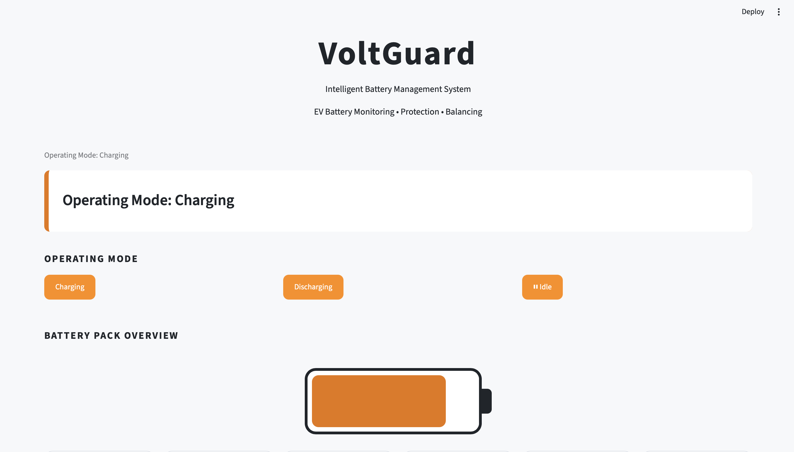
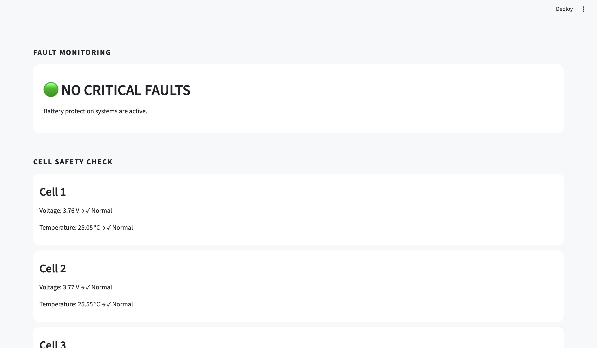
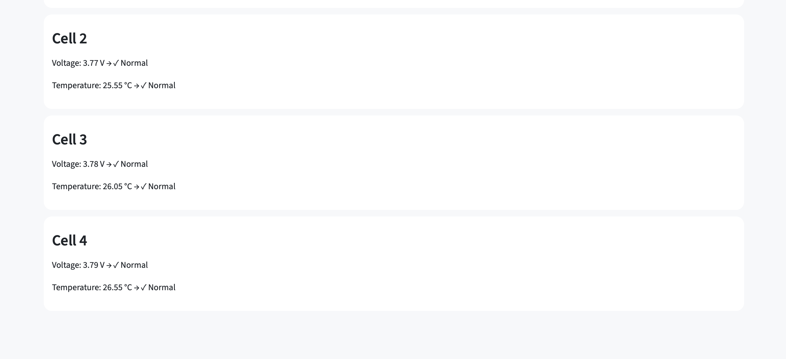

# VoltGuard

## Intelligent Battery Management System (BMS) Simulation Platform

VoltGuard is a battery management system (BMS) simulation dashboard designed to monitor, analyze, and protect an electric vehicle (EV) battery pack.

The system simulates real-time battery telemetry, including cell voltage, temperature, state of charge (SOC), current flow, and power behavior. It implements BMS monitoring logic to detect abnormal operating conditions such as over-voltage, under-voltage, overheating, and cell imbalance.

Built with Python and Streamlit, VoltGuard demonstrates the integration of electrical engineering concepts with software development, data processing, and interactive engineering visualization.

---

## Live Demo

Experience the VoltGuard Battery Management System dashboard:

🚀 **Live Dashboard:**  
https://voltguard-bms-dashboard.streamlit.app/

## Dashboard Preview

### Battery Pack Overview




### Cell Monitoring & BMS Test Mode


### Battery Health Summary & Telemetry Analysis


### Fault Detection Simulation




### Cell Safety Check



# Project Overview

Modern electric vehicles rely on Battery Management Systems to ensure battery safety, performance, and longevity.

A BMS continuously monitors individual battery cells and makes decisions based on:

* Voltage measurements
* Temperature readings
* State of Charge estimation
* Current flow
* Cell-to-cell variations

VoltGuard recreates this workflow through a software-based simulation environment.

The goal of this project is to demonstrate how battery telemetry can be collected, processed, analyzed, and visualized through an intelligent monitoring interface.

---

# System Architecture

```
Battery Telemetry Data
        |
        ↓
Data Processing Layer
        |
        ↓
BMS Monitoring Engine
        |
        ↓
Fault Detection & Safety Analysis
        |
        ↓
Interactive Dashboard
```

---

# Key Features

## 🔋 Battery Pack Monitoring

VoltGuard provides a high-level overview of battery operation:

* State of Charge (SOC)
* Pack voltage estimation
* Temperature monitoring
* Battery health indicator
* Current flow simulation
* Power flow calculation

The dashboard dynamically updates battery behavior based on operating conditions.

---

## ⚡ Cell-Level Monitoring

The system analyzes individual battery cells to identify abnormal behavior.

Each cell displays:

* Cell voltage
* Cell temperature
* Operating status

Example:

```
Cell 1
Voltage: 3.76V
Temperature: 25°C
Status: NORMAL
```

This reflects how real BMS systems monitor individual cells rather than only the entire battery pack.

---

# Fault Detection System

VoltGuard implements battery protection logic for critical conditions.

## Over-Voltage Protection

Detects cells exceeding safe voltage limits.

Example:

```
Cell 3
Voltage: 4.35V

Status:
CRITICAL - Over Voltage
```

---

## Under-Voltage Protection

Identifies cells operating below safe voltage thresholds.

---

## Temperature Monitoring

Detects unsafe thermal conditions.

Example:

```
Cell 4
Temperature: 70°C

Status:
CRITICAL - Over Temperature
```

---

## Cell Imbalance Detection

Analyzes voltage differences between cells.

The system calculates:

* Highest cell voltage
* Lowest cell voltage
* Voltage spread

This represents a key function of battery balancing systems.

---

# Dynamic Battery Simulation

VoltGuard includes interactive operating modes:

## Charging Mode

Simulates battery charging:

* SOC increases
* Positive current flow
* Positive power flow

---

## Discharging Mode

Simulates battery usage:

* SOC decreases
* Negative current flow
* Negative power flow

---

## Idle Mode

Represents a resting battery:

* Stable SOC
* Zero current flow

---

# Dashboard Interface

The dashboard provides:

## Battery Overview

Displays:

* Battery charge level
* Pack statistics
* Operating mode

## Cell Array Status

Provides real-time visualization of every simulated battery cell.

## Telemetry Graphs

Visualizes:

* Cell voltage trends
* Temperature variations

## Fault Monitoring Console

Summarizes battery safety status and detected faults.

---

# Technology Stack

## Programming

* Python

## Framework

* Streamlit

## Data Processing

* Pandas

## Visualization

* Streamlit Charts

## Development Tools

* Git
* GitHub
* VS Code

---

# Engineering Concepts Demonstrated

VoltGuard applies concepts from electrical engineering and embedded systems:

### Battery Systems

* Lithium-ion battery characteristics
* Cell monitoring
* State of Charge concepts
* Battery protection logic

### Electrical Analysis

* Voltage measurement
* Current flow
* Power calculations

### Embedded/System Thinking

* Sensor telemetry simulation
* Real-time monitoring architecture
* Fault response logic

### Software Engineering

* Modular Python development
* Data-driven simulation
* Interactive user interface design

---

# Future Improvements

Possible extensions include:

* Real SOC estimation using coulomb counting
* State of Health (SOH) degradation modeling
* Battery cell balancing algorithm
* CAN bus communication simulation
* Real sensor data integration
* Machine learning-based battery fault prediction

---

# Project Structure

```
VoltGuard-bms/

│
├── dashboard/
│   ├── app.py
│   ├── style.css
│   └── requirements.txt
│
├── data/
│   ├── telemetry.csv
│   ├── status.txt
│   └── fault_log.txt
│
└── README.md
```

---

# Author

Anushka Ahsan

Electrical Engineering Student

McGill University

Interested in:

* Embedded Systems
* Battery Management Systems
* Electric Vehicles
* Energy Systems

---

## License

This project is developed for educational and portfolio purposes.
